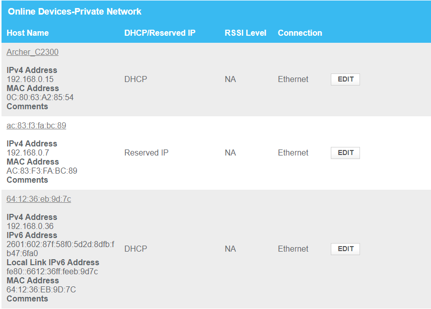
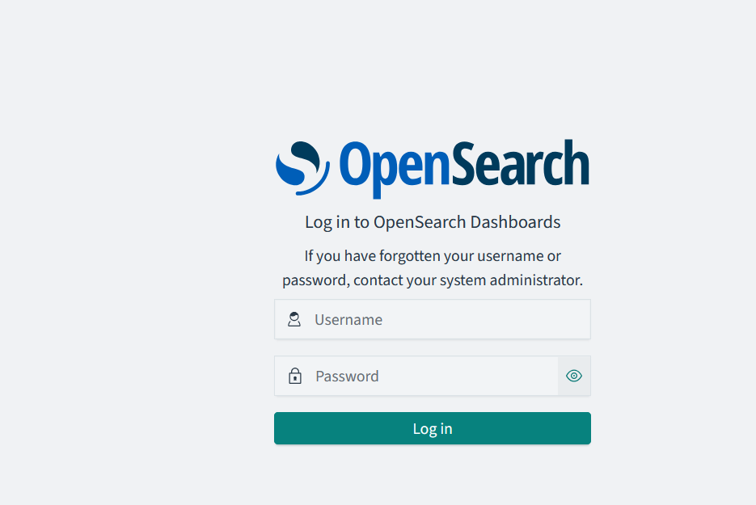

This guide consists of two sections:
1. [Evaluating security settings of network devices](#networkdevices)
2. [Setting up network security monitoring in your network](#nsm)

<a name="networkdevices"></a>
## 1. Evaluating security settings of network devices
This section will guide you through the process of evaluating the security settings of network devices.

### Router
This guide will help you find your router's gateway (default IP address) using command-line tools and access it via your web browser. As an example I cover how to log in to an Xfinity router but others are fairly similar.

#### 1. Open Command Prompt or Terminal
- **Windows**: Press `Windows + R`, type `cmd`, and press Enter.
- **Mac/Linux**: Open the **Terminal** from your Applications or search for it.

#### 2. Find the Gateway Address

In the command prompt, type the following command and press Enter:
```ipconfig``` (Windows) or ```ifconfig``` (Mac/Linux)

Look for the **Default Gateway** under your network adapter. This is your router's IP address. In Linux, it's usually under `inet addr`.

An alternative approach is to look for your routing settings on your computer.

In Windows, type:
```route PRINT```
Look for IPv4 Route Table and find the Gateway address at the top usually.

In Mac/Linux, type:
```route -n``` or ```ip route show```
Look for the Gateway address under the `Destination` column.

Example (output may vary):
```
IPv4 Route Table
===========================================================================
Active Routes:
Network Destination        Netmask          Gateway       Interface  Metric
          0.0.0.0          0.0.0.0      192.168.0.1    192.168.0.209     45
        127.0.0.0        255.0.0.0         On-link         127.0.0.1    331
        127.0.0.1  255.255.255.255         On-link         127.0.0.1    331
     172.22.112.0    255.255.240.0         On-link      172.22.112.1   5256
     172.22.112.1  255.255.255.255         On-link      172.22.112.1   5256
```

In this example, the Gateway address is `192.168.0.1`.

#### 3. Access the Router
Using the router's IP address, open a web browser and type it in the address bar (e.g., 192.168.0.1). Then press Enter.

You will be prompted to enter a username and password. The default credentials are usually found on the router itself or in the manual. Common defaults are `admin` for both username and password, or `password` for password. You may have to google search for your router's default credentials (e.g., "Xfinity router default login").

After successfully logging in, you can navigate through the router's settings to evaluate its security settings.

#### 4. Evaluate WiFi Security
Find the WiFi settings (e.g., Connection -> WiFi) and check the following:
- **Security Type**: Use WPA2 or WPA3 for better security.
- **Password**: Ensure a strong password is set.
- **Guest Network**: Disable if not needed. But consider enabling it if you have many guest as it isolates them from your main network.

#### 5. Connected Devices
Look for a section that shows connected devices. Ensure you recognize all devices connected to your network. For example look at the following image:
[](img/connected-devices.png)

You can see the devices are either recognized by name, or shown with their MAC address. The associated IP provided by the router's DHCP is also shown. Devices that are permanent in your network should have a static IP assigned. You can do so in the device but it is better to do so on the router since this way the router's DHCP will not assign the IP to another device.

In the above image, if you click Edit, you can assign a static IP (also referred to as Reserved IP) to the device.

#### 6. Remote Management
Look for a setting that allows remote management of the router. This should be disabled unless you need it. Remote management allows you to access the router's settings from outside your network. If enabled, ensure it is secured with a strong password. Example in the following image:
[](img/remote-management.png)

#### 7. DMZ
The DMZ (Demilitarized Zone) setting allows you to expose a device to the internet. This should be used with caution and only if you know what you are doing.

#### 8. Device Discovery (UPnP)
Universal Plug and Play (UPnP) allows devices to discover each other on the network. This can be a security risk as it opens ports on the router. It is recommended to disable this unless you need it for specific applications.

<a name="nsm"></a>
## 2. Setting up network security monitoring in your network

There are several ways to setup network security monitoring in your network especially for following the subsequent chapters of the book. I have a few options but it will highly depend on the degree of time you want to put in and the available resources.

- **Option 1**: [Full Hardware Solution (Difficult)](#nsm-hardware)
- **Option 2**: [Running locally on prefabricated VM (Easy)](#nsm-vm)

<a name="nsm-hardware"></a>
### Option 1: Full Hardware Solution (Difficult)
This is the most comprehensive solution but also the most expensive. 

#### IDS Device
You'll need a device to run your IDS stack. You can use any computer or even somewhat older laptop but they draw power and they have to be always on. A single board computer like a Raspberry Pi is preferable especially for your home network. Two options are:
- Raspberry Pi 4 (8GB RAM) [Amazon](https://www.amazon.com/CanaKit-Raspberry-8GB-Basic-Starter/dp/B08956GVXN)
- Beelink Mini PC (at least 8GB RAM) [Amazon](https://www.amazon.com/Beelink-Desktop-Computer-Support-Ethernet/dp/B0BVLPCDVW)

Because Raspberry Pi 4 is ARM architecture, Beelink is preferable as it is x86_64 architecture and most software is compiled for it. The guide will continue with Beelink in mind. The good news is that it comes with disk and everything else that you need.

Beelink comes with Windows installed which is not what we need. Instead you'll install Linux on it:
1. Download Ubuntu Server 24.04 LTS from [here](https://ubuntu.com/download/server)
2. Create a bootable USB using [Rufus](https://rufus.ie/) or [Balena Etcher](https://www.balena.io/etcher/)
3. Find a spare USB drive (at least 8GB) and plug it in your computer.
4. On Rufus, select the USB drive, select the Ubuntu ISO, and click Start.
5. Plug the USB drive in the Beelink and boot from it. You will need to have a keyboard and a monitor plugged into Beelink for this step. You may have to press F7 to enter the boot menu, then select the USB drive (it will likely say Ubuntu).
6. Select Keyboard layout, language, and other settings.
7. If ethernet is connected, it will ask you to configure it. If not, you can do it later. Hit skip.
8. Select drive full erase and install Ubuntu. DO NOT select LVM or encryption as it will complicate setup. If you have done this before, feel free to ignore this advise.
9. Give a username and a password. You can use the same password for the root account.
10. Enable openssh server (this is important for remote access).
11. After the install is over, remove the USB drive and reboot.
12. Beelink is now a ready to use server for your IDS stack. You can disconnect any keyboard and monitor from it.

Next up, we need to install on Beelink the necessary software.

1. Plug Beelink's ethernet into your router. This won't be its final location, just a temporary for setting up.
2. Boot it up and then find its IP address in your network. You can do this by logging into your router and looking at the connected devices. Or since we know that SSH is active, you can do `nmap -p 22 192.168.0.0/24` to find devices in your subnet that have port 22 open (i.e., SSH). Remember to replace your subnet with the correct one based on your network.
3. Get to your Laptop or Desktop. If you are using Windows, download [Putty](https://www.chiark.greenend.org.uk/~sgtatham/putty/latest.html) and install it. If you are using Mac or Linux, you can use the Terminal.
4. Open Putty and enter the IP address of Beelink. Click Open. For Mac or Linux, type `ssh username@ipaddress` where username is the username you chose during the Ubuntu install and ipaddress is the IP address of Beelink.
5. Enter the password when prompted.
6. Now you should see a terminal and be able to type commands.
7. Install docker using the following guide (the three steps, you can copy-paste them): [Docker Install Guide](https://docs.docker.com/engine/install/ubuntu/#install-using-the-repository).
8. Once docker is installed, you will take the book's shortcut that comes with all prepackaged IDS software needed. This saves you time. You need to install git to download the repository containing the necessary setup. Type `sudo apt install git` to install git.
9. Then, clone the repository using `git clone https://github.com/tsikerdekis/applied-network-security-analysis.git`.
10. Change directory to the repository using `cd applied-network-security-analysis`.
11. Before starting, you'll need to know the Ethernet interface of Beelink you wish to monitor. This is usually eth0 but just in case type `ifconfig` and look for the interface that has an IP address, within your subnet. For example:
```
enp2s0: flags=4419<UP,BROADCAST,RUNNING,PROMISC,MULTICAST>  mtu 1500
        inet 192.168.0.17  netmask 255.255.255.0  broadcast 192.168.0.255
        inet6 2601:602:87f:58f0:2c0:8ff:fe93:ed95  prefixlen 64  scopeid 0x0<global>
        inet6 2601:602:87f:58f0::5313  prefixlen 128  scopeid 0x0<global>
        inet6 fe80::2c0:8ff:fe93:ed95  prefixlen 64  scopeid 0x20<link>
        ether 00:c0:08:93:ed:95  txqueuelen 1000  (Ethernet)
        RX packets 182561322  bytes 216644080011 (216.6 GB)
        RX errors 0  dropped 146118  overruns 0  frame 0
        TX packets 17748231  bytes 2918875770 (2.9 GB)
        TX errors 0  dropped 0 overruns 0  carrier 0  collisions 0
```
Make a note of the code (e.g., enp2s0) that is associated with network interface.
12. To load the IDS software, type `bash start.sh`. This will prompt you with a few questions about your network, provide the answers based on what you know. It will also take a while for everything to be download and started. Be patient. When everything returns to prompt, you are ready to go. Example image:
[](img/nsm-ready.png)

You can also verify that everything works by opening a browser and typing the IP address of Beelink. You should see the Opensearch Dashboards interface. Example image:
[](img/dashboards.png)

At this point you can also go to your router and assign a fixed IP for beelink. This way, you can always access it using the same IP.

#### Network Tap
You can either use a passive or active tap. Passive taps are easier to use but active taps are more versatile. One active tap that you can use is a switch like [https://www.amazon.com/TP-LINK-TL-SG105E-5-Port-Gigabit-Version/dp/B00N0OHEMA](TP-Link TL-SG105E). This switch has a feature called port mirroring that allows you to mirror all traffic from one port to another.

1. Connect the switch to your router.
2. Connect Beelink to the switch.
3. Find the IP address of the switch's web management interface. It is usually acquired from DHCP but you if you are unsure, either look at the switche's manual or use a network scanner like nmap (e.g., `nmap -p 80 192.168.0.0/24`) and try any IPs that look positive.
4. Open a browser and type the IP address of the switch. You will be prompted to enter a username and password. The default credentials are usually found on the switch itself or in the manual. Common defaults are `admin` for both username and password, or `admin` for username and `admin` for password. You may have to google search for your switch's default credentials (e.g., "TP-Link TL-SG105E default login").
5. Find the port mirroring setting and mirror the port that Beelink is connected to. This way, Beelink will see all traffic that goes through the switch. Setup for ingress-egress data duplication the port that leads to your ISP router (edge router). Example image:
[](img/port-mirroring.png)
6. Now data should be flowing to Beelink and you can start monitoring your network.

#### WiFi Router
If you have a WiFi router, you can connect it to the switch and use it as an access point. This way, all WiFi traffic will also be monitored. DO NOT use your ISP's router as a WiFi router as traffic won't flow through the switch, especially for internet communications. Instead, buy a separate one. Example [https://www.amazon.com/WiFi-6-Router-Gigabit-Wireless/dp/B08H8ZLKKK](TP-Link Archer AX1800).

1. Get your laptop or desktop and connect to the WiFi router using an ethernet cable. DO NOT connect to the Wifi or have anything else networked connected to it.
2. Use the guide to find the default IP address of the WiFi router and access it through your browser.
3. Set the WiFi router to Access Point mode. This will disable the router functionality and make it act as a switch. This way, all traffic will flow through the switch and to Beelink. 
4. For DHCP, you can either disable it on the WiFi router or more advanced users can split the subnet. For example, on the ISP's router can set the range from 192.168.0.30 to 192.168.0.100 and the WiFi router from 192.168.0.101 to 192.168.0.254. Notice that I left an IP range from .1 to .30 outside DHCP. This is for setting up static devices so that the DHCP won't assign these IPs somewhere else. DO NOT use two DHCPs with the same range and DO NOT use separate subnets (e.g., 192.168.0.0/24 and 192.168.1.0/24) as this will complicate the setup.
5. Assign a static IP to your WiFi router. This way, you can always access it using the same IP. It should be an IP that is used.
6. Connect the WiFi router to the switch and you are ready to go.

#### Wired devices
If you have wired devices, you can connect them to the switch or the WiFi router. If you connect them on the ISP's router then their traffic will likely won't be monitored.


#### Topology Example

Here is an example of the topology you should have after following the above steps:
```
    +-------------------+
    |    Edge Router    |
    +-------------------+
                |
                |
                |
    +-------------------+
    |      Switch       |
    +-------------------+
        |               |
        |               |
        |               |   
 +-------------------+  |
 |   WiFi Router     |  |
 +-------------------+  |
                        |  
                        |
        +-------------------+
        |        IDS        |
        +-------------------+
```

<a name="nsm-vm"></a>
### Option 2: Running locally on prefabricated VM (Easy)
This is the easiest way to get started but with on major caveat. You won't be monitoring your network but you will still practice with already collected data that I'm including in the virtual image.

You can download a VM that has everything preinstalled and ready to go. You can download the VM from [here](https://drive.google.com/file/d/1Q6J9Q6Q6J9Q6Q6J9Q6Q6J9Q6Q6J9Q6J9Q6J9Q6J9Q6Q6J9Q6.

1. Download the VM.
2. Download VirtualBox from [here](https://www.virtualbox.org/wiki/Downloads). This is the Virtualization software that will load the image.
3. Install VirtualBox.
4. Open VirtualBox and click on Import Appliance.
5. Select the downloaded VM and click Open.
6. Click Import.
7. Once the import is over, click Start.
8. The VM will boot and you will see a login screen. The username is `nsm` and the password is `nsm`.
9. Once logged in, open a browser and type `localhost:5601`. You will see the Opensearch Dashboards interface. Example image:
[](img/dashboards.png)
10. You can now start following the book's chapters.
