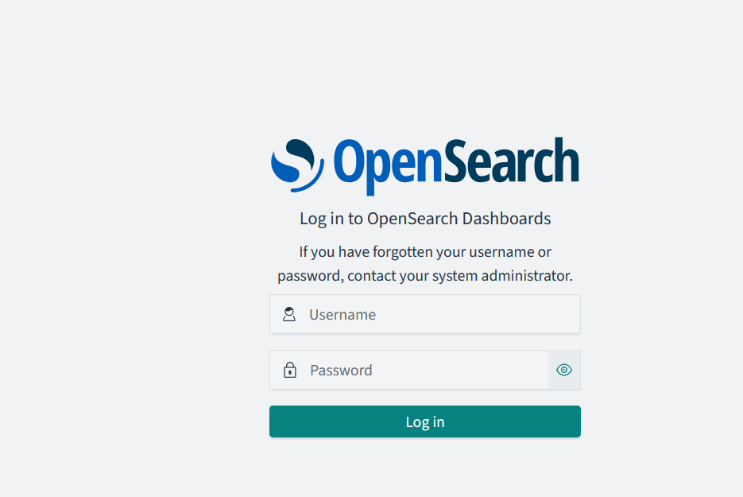

# Option 2: Running locally on prefabricated VM (Easy)
This is the easiest way to get started but with on major caveat. You won't be monitoring your network but you will still practice with already collected data that I'm including in the virtual image.

You can download a VM that has everything preinstalled and ready to go. You can download the VM from [here](https://drive.google.com/file/d/1OFtSnGJUOTJC04cmsRnJZy046_Mlz-7-/view?usp=sharing).

A video exists to help with the setup that can be seen [here](https://youtu.be/l6q9-l5nBH8). Or if you are confident enough, you can follow the steps below.

## Steps

1. Download the VM.
2. Download VirtualBox from [here](https://www.virtualbox.org/wiki/Downloads). This is the Virtualization software that will load the image.
3. Install VirtualBox.
4. Open VirtualBox and click on Import Appliance.
5. Select the downloaded VM and click Open.
6. Click Import. Make sure to select "all network adapters" to be included (not just NAT). All other settings you can leave as default.
7. Once the import is over, click Start.
8. The VM will boot and you will see a login screen. The username is `netsec` and the password is `netsec123`.
9. Once logged in, open a browser and type `localhost:5601`. You will see the Opensearch Dashboards interface. Example image:
.
10. The login information for the web interface is `admin` and the password is `Netsec123`.
