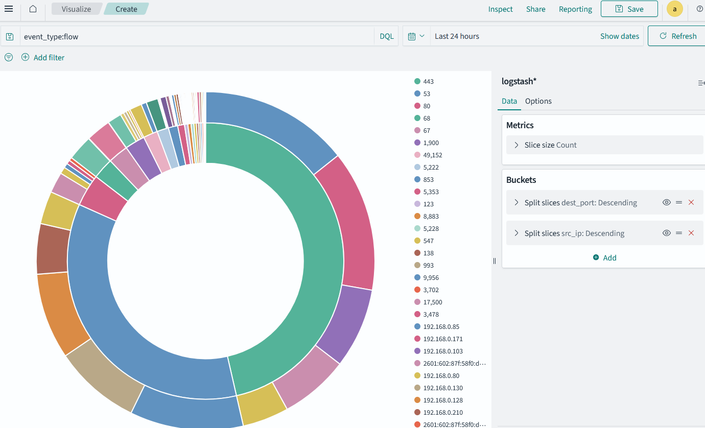

# Chapter 3: Understanding the Basics of TCP/IP

The Discover is good for forensics and understanding the data that is collected. It is not the best for real-time monitoring. For that, you would use the "Dashboard" tab. But for now, let's focus on the Discover tab as way to help you understand some basics.

## Using the Discover tab
Let's try viewing protocols in the discover tab and undestanding the data.

1. In the left top area, click on the three dashes and then at the bottom scroll to "Discover"
2. You should see the data that are collected. In the top left, you should see the index (logstash*) where the data are ready from and you should also see the count of hits. These are the number json records created by Suricata (includes Netflow, Alerts, etc.)
3. The panel is separated by the fields to the left, a histogram in the middle that displays the number of records (not packets or data), a short list of records (up to 500 typically) and a search bar at the top to filter data.

## Types of data produced by Suricata IDS

### Netflow

This is the data that shows the flow of data between two devices. It includes the source and destination IP, the source and destination port, the protocol used, and the number of packets and bytes transferred. You can filter these by using `event_type: flow` in the search bar.

Alternatively, you can hit "Add filter" and select `event_type` and then `is` and type `flow`.

To make flow data more readable use the left pane and click on `+` icon by hovering the mouse over the following:
- src_ip
- dest_ip
- src_port
- dest_port
- total_bytes

Hint: there is a "Search field" at the top right that you can use to search for fields to find them faster.

### Alerts

Use `event_type: alert` in the search bar to filter alerts. You can use the '>' icon to expand the alert and see the details. The most important field with respect to alerts is the `alert.signature`. You can add that from the left pane to make it more readable.

If you need remove any of the fields shown, you can click on the 'x' icon next to the field name. You'll need to hover your mouse over it.

### DNS

Use `event_type: dns` in the search bar to filter DNS data. You can use the '>' icon to expand the DNS data and see the details. The most important field is `dns.answers.rname`.

### HTTP

Http data is less important since most traffic is encrypted with HTTPS. But it is still useful to see what is happening.

Use `event_type: http` in the search bar to filter HTTP data. You can use the '>' icon to expand the HTTP data and see the details. The most important field is `http.hostname`.

## Advanced queries and optimization

### AND operator
You can use the search bar to filter data. For example, you can type `event_type: flow` to see only flow data. You can also use `src_ip:` to filter by source IP. For example, `src_ip: 192.168.0.17` will show only data from that IP. The complete query is:

```
event_type: flow AND src_ip:192.168.0.17
```

Or you can manually add both filters by clicking on "Add filter" and selecting `event_type` and `src_ip` and then typing the IP.

You can add as many conditions as you like by using the `AND` operator. This helps you make your queries more specific when examining data.

### OR operator

You can also use the `OR` operator to combine conditions. For example, you can type:

```src_ip:192.168.0.17 OR src_ip: 192.168.0.1```

This will show data from either IP address.

### NOT operator

You can use the `NOT` operator to exclude data. For example, you can type:

```NOT src_ip:192.168.0.17```

This will show data from all IPs except 192.168.0.17.

### Wildcards

You can use wildcards to search for partial matches. For example, you can type:

```src_ip:192.168.*```

This will show data from all IPs that start with 192.168. However for IPs you can use CIDR notation for a subnet. For example, `src_ip: 192.168.0.0/16` will show data from all IPs in the 192.168.x.x range.

### Range

You can use ranges to filter data. For example, you can type:

```total_bytes: [1000 TO 5000]```

This will show data where the total bytes transferred is between 1000 and 5000.

### Time range

You can use time ranges to filter data. For example, you can type:

```@timestamp: [2022-01-01T00:00:00 TO 2022-01-01T23:59:59]```

This will show data from January 1st, 2022.

### Combining conditions

You can combine conditions using parentheses. For example, you can type:

```(src_ip:192.168.0.17) AND (total_bytes: [1000 TO 5000])```

This will show data from IP 192.168.0.17 where the total bytes transferred is between 1000 and 5000.

### Saving queries

You can save queries by clicking on the floppy disk icon next to the search bar. This allows you to reuse queries later.

### Exporting data

You can export data by clicking on the floppy disk icon next to the search bar and selecting "Download CSV". This allows you to save the data to a CSV file for further analysis.

### Efficiency in searches

When you search for data, try to be as specific as possible to reduce the number of records returned. This will make your searches faster and more efficient. Wildcards can slow down searches, so use them sparingly. Also for text fields, prefer to use the `keyword` field instead of the `text` field. For example, use `src_ip.keyword` instead of `src_ip`. This makes so that the exact match is used instead of a full-text search.

## Your first visualization

Now that you have a basic understanding of the data, let's create a visualization. We will create a pie chart to show the distribution of ports in the flow data.

1. Click on the "Visualize" tab in the left top area.
2. Click on "Create visualization".
3. Select "Pie" as the visualization type.
4. Select the index pattern (logstash*) and click "Next step".
5. Select "Split slices" and then "Aggregation" as "Terms".
6. Select "Field" as `dest_port` and click "Apply".
7. To make sure that you are looking only at connection data, you'll have to filter so that only NetFlows are shown. You can do this by clicking on the "Add filter" button and selecting `event_type` and then `is` and typing `flow`.
8. To view more than 5 ports, you can click on the "Options" tab and increase the "Size" to 20.
9. To add another ring to the pie chart, you can click on the "Add" button and select "Sub-buckets" and then "Split slices". Then, select "Aggregation" as "Terms" and "Field" as `src_ip`. This will show the distribution of ports by source IP.


Now, hover your mouse and observe the src_ip and dest_port distribution. I'll take a wild guess that the largest slice is for dest_port 443 (HTTPS). Second most used port is 53 (DNS).

To save the visualization, click on the floppy disk icon at the top right and give it a name. This will save all your slices along with the filters that you have applied to this visualization. Here's a screenshot of how it looks on my interface.

[](img/pie-chart.png)

