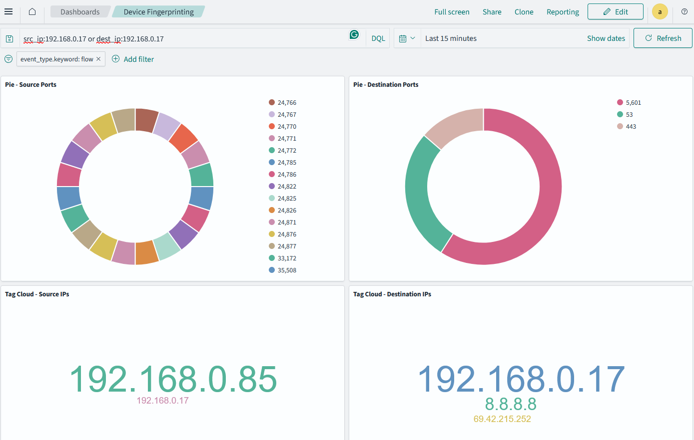

# Chapter 4: Securing your Endpoint Devices

## Inventory of endpoint devices

## Fingerprinting devices
Time for something more advanced. We'll build an IP fingerprinting dashboard. Basically a dashboard that can tell us all that a device is doing. This is useful for identifying rogue devices on your network.

### Step 1: Port visualizations
We'll start by creating two pie charts, one for source ports and the other for destination ports. This will give us an idea of the most common ports being used by devices on the network.

1. Go to the Opensearch Dashboards web interface.
2. Click on the "Visualize" tab in the left top area.
3. Click on "Create visualization".
4. Select "Pie" as the visualization type.
5. Select the index pattern (logstash*) and click "Next step".
6. Select "Split slices" and then "Aggregation" as "Terms".
7. Select "Field" as `src_port` and click "Apply".
8. Increase the "Size" to 20 to show the top 20 source ports.
9. Click on the "Save" button to save the visualization as "Pie - Source Ports".

Repeat the same steps for destination ports, using `dest_port` as the field.

### Step 2: Tag cloud for IP addresses
Next, we'll create a tag cloud visualization to show the most common IP addresses in the network.

1. Click on the "Visualize" tab in the left top area.
2. Click on "Create visualization".
3. Select "Tag cloud" as the visualization type.
4. Select the index pattern (logstash*) and click "Next step".
5. Select "Aggregation" as "Terms".
6. Select "Field" as `src_ip.keyword` and click "Apply".
7. Increase the "Size" to 20 to show the top 20 IPs.
8. Click on the "Save" button to save the visualization as "Tag Cloud - Source IP".

Do the same for destination IP addresses using `dest_ip.keyword` as the field.

### Step 3: Geo information for IP addresses
Now, let's create a map visualization to show the geographical locations of the IP addresses.

1. Click on the "Visualize" tab in the left top area.
2. Click on "Create visualization".
3. Select "Coordinate map" as the visualization type.
4. Select the index pattern (logstash*) and click "Next step".
5. Select "Geohash" as the aggregation.
6. Select "Field" as `geoip.geohash` and click "Apply".

I'm going to pause here and clarify that this visualization may show both source and destination IPs. How's that? You can capture the following (usually):

- Source IP local, Destination IP external: This is outgoing traffic.
- Destination IP local, Source IP external: This is incoming traffic.
- Source IP local, Destination IP local: This is internal traffic.

GeoIP information is created for the first two choices and for the external side of things. So to properly make this visualization be about source IP for example, we have to filter the data. We have to say in the filter that we want all data for which source IP is a non-routable IP address.

```
src_ip: 10.0.0.0/8 OR src_ip: 172.16.0.0/12 OR src_ip: 192.168.0.0/16
```
Now save the visualization as "Map - Source IP".

You can create also a "Map - Destination IP" visualization by filtering for destination IPs that are non-routable. Just switch `src_ip` for `dest_ip`.

### Step 4: Device fingerprinting dashboard

Now that we have the individual visualizations, let's combine them into a dashboard to get a comprehensive view of the network.

1. Click on the "Dashboard" tab in the left top area.
2. Click on "Create dashboard".
3. Click on "Add" and select the visualizations we created earlier (Pie - Source Ports, Pie - Destination Ports, Tag Cloud - Source IP, Map - Source IP).
4. Arrange the visualizations on the dashboard as desired.
5. Add a filter for `event_type.keyword` and set it to `flow` to focus on netflow data only.
6. Click on the "Save" button to save the dashboard.
7. Name the dashboard "Device Fingerprinting".

### Step 5: How to use it

Now that you have the device fingerprinting dashboard set up, you can use it to identify devices on your network based on their behavior. For example, say that you want to analyze the traffic produced by 192.168.0.17. You can filter the visualizations to show only data related to that IP address.

```src_ip:192.168.0.17 or dest_ip:192.168.0.17```

Here are some tips on how to use it effectively:

- Look for devices that are communicating on unusual ports or with unusual IP addresses.
- Check the geographical locations of the IP addresses to identify any unexpected traffic.
- Use the tag cloud to quickly identify the most active devices on the network.

Here's how my fingerprinting dashboard looks like:



## Scanning for open ports
Once you have a list of all local IPs in your network, you can use `nmap` to scan for open ports. This will help you identify services running on each device. Here's how you can do it:

1. Open a terminal window.
2. Run the following command to scan for open ports in the subnet 192.168.0.0/16 using nmap:
```
nmap -p 1-65535 192.168.0.0/24
```
This command will scan all ports (1-65535) in the specified subnet and provide information about open ports on each device.

3. Analyze the results to identify any unexpected or suspicious services running on your devices.