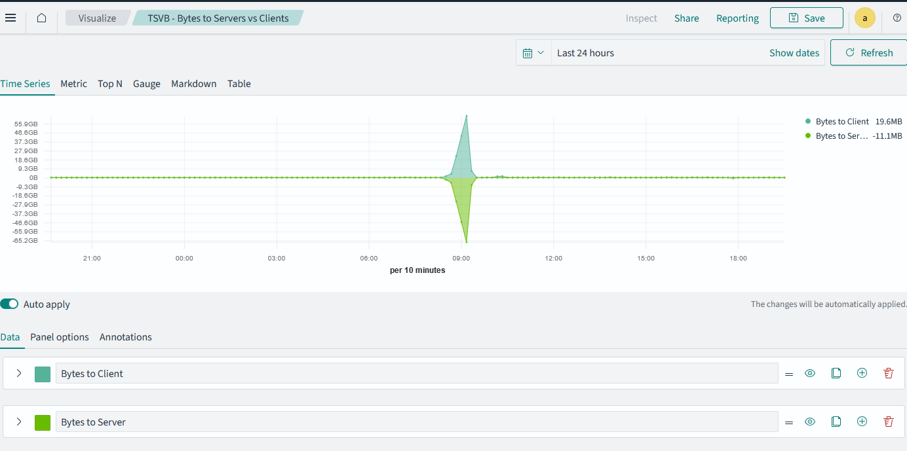
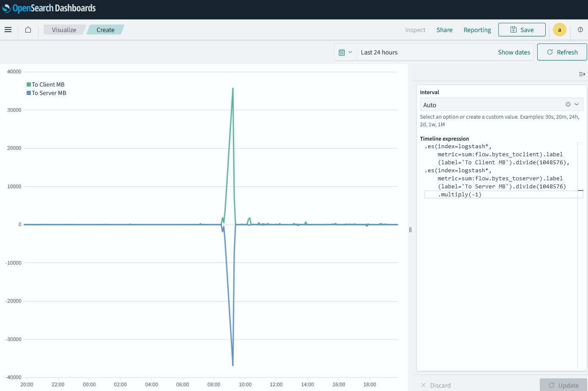
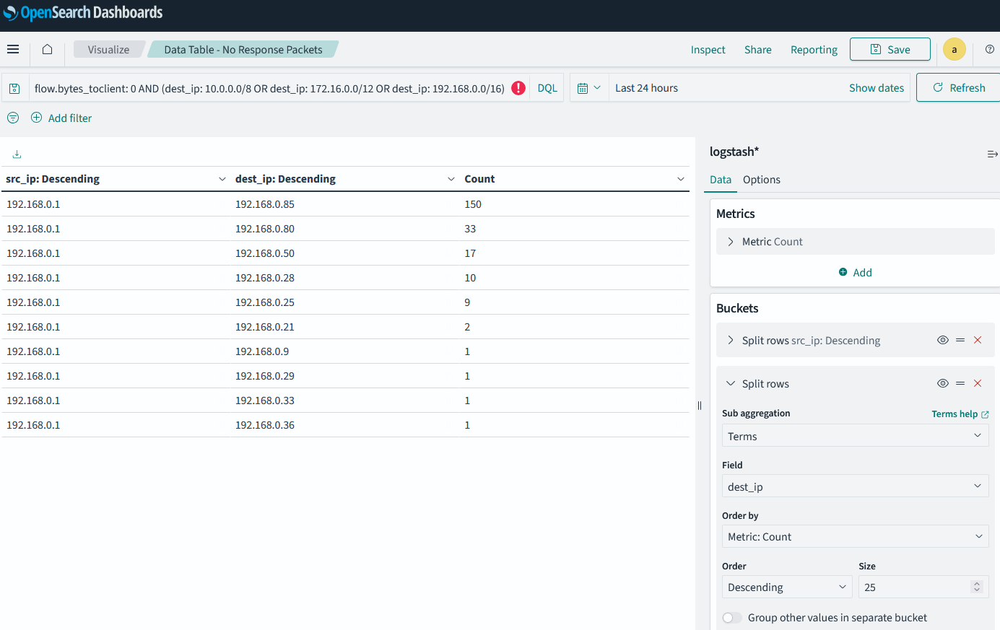

# Chapter 5: Evaluating the Perimeter

To evaluate your perimeter you have to establish which are your edge devices. Likely with the previous chapter's fingerprinting and list of IPs in your local network, you'll at least have identified your edge router (hint: it's also your gateway in `route -n` or `route PRINT` depending on whether you are on Linux or Windows). Mine is 192.168.0.1 so the guide will use this one for now. Include in this list any devices that may have open ports (you'll likely know this because of any port forwarding that you may have setup).

## Evaluating open ports to the outside world
You can build a visualization to show all the open ports on your edge devices. This will help you identify any ports that are open to the outside world and may be a security risk.

1. Go to the Opensearch Dashboards web interface.
2. Click on the "Visualize" tab in the left top area.
3. Click on "Create visualization".
4. Select "Data table" as the visualization type.
5. Select the index pattern (logstash*) and click "Next step".
6. Select "Split rows" and then "Aggregation" as "Terms".
7. Select "Field" as `dest_port` and click "Apply".
8. Increase the "Size" to 1000 to show all the open ports.
9. Then you'll need to filter so that you look at only destination IPs that are local, and source IPs that are not local and for ports that are less than 20,000 (common ports for services, you can increase to find other no standard ports):
```
(dest_ip: 10.0.0.0/8 OR dest_ip: 172.16.0.0/12 OR dest_ip: 192.168.0.0/16) AND (NOT src_ip: 10.0.0.0/8 AND NOT src_ip: 172.16.0.0/12 AND NOT src_ip: 192.168.0.0/16) AND dest_port < 20000
```
10. Click on the "Save" button to save the visualization as "Data Table - Open Ports".

<a name="bytes-to-server-to-client"></a>
## Examining bytes to servers vs to clients
There are two ways to build such a visualization:
- using TSVB (Time Series Visual Builder) to build a line chart that shows the bytes sent to servers and to clients over time.
- using Timeline to build a visualization that shows the bytes sent to servers and to clients over time.

### Using TSVB
1. Go to the Opensearch Dashboards web interface.
2. Click on the "Visualize" tab in the left top area.
3. Click on "Create visualization".
4. Select "Time Series Visual Builder" as the visualization type.
5. Select the index pattern (logstash*) and click "Next step".
6. Select "Aggregation" as "Sum". Then select "Field" as `flow.bytes_toclient` and click "Apply".
7. In label write "Bytes to Client".
8. Click "Options" and select "Data Formatter" as "Bytes".
9. Click the small + to add another "Series". This will be in the right hand side.
10. Select "Aggregation" as "Sum". Then select "Field" as `flow.bytes_toserver` and click "Apply".
12. Next to the "flow.bytes_toserver" field, there is "+" button that says "Add Metric." Click on it.
13. Select "Aggregation" as "Math." Then under Variables name a variable "toserver" and assign the "Sum of flow.bytes_toserver" field to it.
14. In the expression type `-1 * params.toserver`.
15. In label write "Bytes to Server".
16. Click "Options" and select "Data Formatter" as "Bytes".
17. Click on the "Save" button to save the visualization as "TSVB - Bytes to Servers vs Clients".

Here's how the image looks like:


### Using Timeline

1. Go to the Opensearch Dashboards web interface.
2. Click on the "Visualize" tab in the left top area.
3. Click on "Create visualization".
4. Select "Timeline" as the visualization type.
5. Then on the right hand side, type the following:

```
.es(index=logstash*,metric=sum:flow.bytes_toclient).label(label='To Client MB').divide(1048576),
.es(index=logstash*,metric=sum:flow.bytes_toserver).label(label='To Server MB').divide(1048576).multiply(-1)
```
6. Click on the "Save" button to save the visualization as "Timeline - Bytes to Servers vs Clients".

Here's how it looks like:


## Evaluating no response packets
You can build a visualization to show all the packets that are sent but do not receive a response. This can often indicate potential scans or misconfigurations.

1. Go to the Opensearch Dashboards web interface.
2. Click on the "Visualize" tab in the left top area.
3. Click on "Create visualization".
4. Select "Data table" as the visualization type.
5. Select the index pattern (logstash*) and click "Next step".
6. Select "Split rows" and then "Aggregation" as "Terms".
7. Select "Field" as `src_ip.keyword` and click "Apply".
8. Increase the "Size" to 1000 to show all the devices in the network.
9. Then you'll need to filter for only local network IPs and 0 bytes as a response to client (the initiator of the connection, usually `src_ip`):
```
flow.bytes_toclient: 0 AND dest_ip: 10.0.0.0/8 OR dest_ip: 172.16.0.0/12 OR dest_ip: 192.168.0.0/16
```
This effectively shows IPs that sent messages out but never received a response.
11. Click to split rows again and select "Aggregation" as "Terms".
12. Select "Field" as `dest_ip.keyword` and click "Apply".
13. Increase the "Size" to 1000 to show all the devices in the network.
14. Save the visualization as "Data Table - No Response Packets".

Here's how it looks:


## Evaluating mail traffic

You can build a visualization to check for time series byte traffic to mail traffic (assuming you have a mail server running on your network). This can help you identify spam campaigns to the server (usually the volume would be higher).

1. Go to the Opensearch Dashboards web interface.
2. Click on the "Visualize" tab in the left top area.
3. Click on "Create visualization".
4. Select "Timeline" as the visualization type.
5. Then on the right hand side, type the following:

```
.es(
  index=logstash*, 
  q='dest_port:(25 OR 587 OR 465) AND (dest_ip:(10.0.0.0/8 OR 172.16.0.0/12 OR 192.168.0.0/16))',
  metric='sum:total_bytes'
).label('Byte Traffic for Mail Ports to Non-Routable IPs').divide(1048576)
```