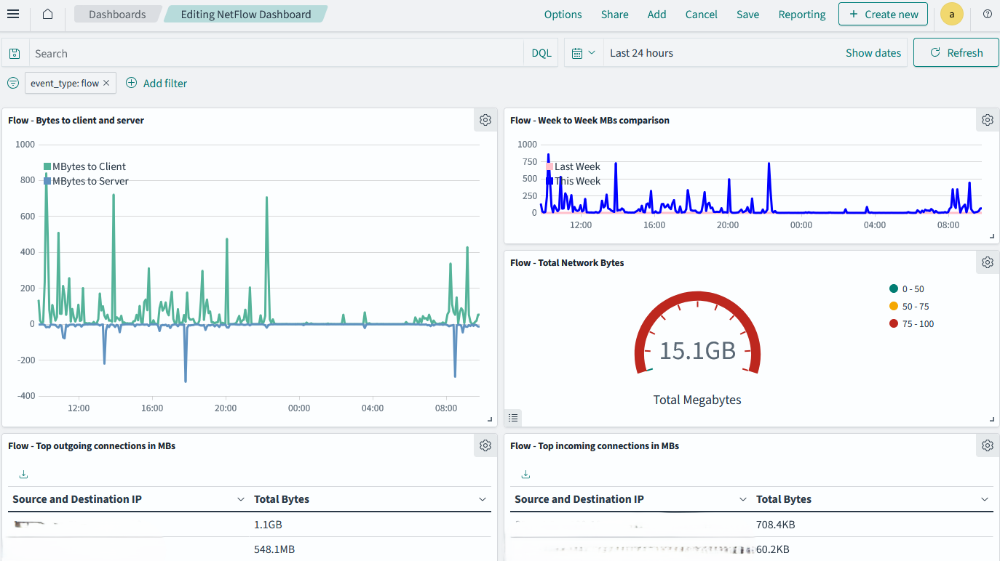
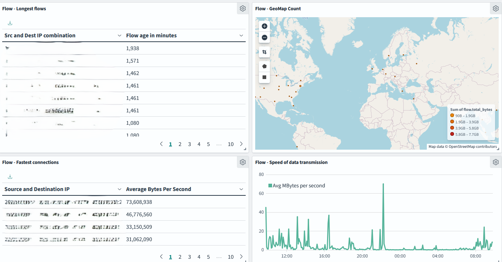

# Chapter 6: Detecting Data Theft using NetFlow

## Bytes to servers vs to clients
You've already built this in chapter 5 but if not visit [here](../chapter_05/README.md#bytes-to-server-to-client).

## Comparing week to week traffic
You can build a visualization to compare the traffic from one week to another. This can help you identify any anomalies in the network traffic.

1. Go to the Opensearch Dashboards web interface.
2. Click on the "Visualize" tab in the left top area.
3. Click on "Create visualization".
4. Select "Timeline" as the visualization type.
5. Then on the right hand side, type the following:

```
.es(index=logstash*, metric=sum:flow.total_bytes, timefield=@timestamp, offset=-1w).label('Last Week').color(pink).divide(1048576),
.es(index=logstash*, metric=sum:flow.total_bytes, timefield=@timestamp).label('This Week').color(blue).divide(1048576)
```

## Total bytes on network
This may seem like a silly visualization but it has been useful to only keep a benchmark on total traffic but to also prove that my traffic limits imposed by my ISP are being met. True story!

1. Go to the Opensearch Dashboards web interface.
2. Click on the "Visualize" tab in the left top area.
3. Click on "Create visualization".
4. Select "Gauge" as the visualization type.
5. On the right hand side, select "Sum" and then "flow.total_bytes" as the field.
6. Restrict the visualization using the following filter `event_type.keyword:flow`.
7. Click on the "Save" button to save the visualization as "Total Bytes on Network".

## Pairs of source and destination IPs and total bytes

You cannot show pairs of source and destination IPs in a single column. For that, you'll need to create a scripted field that concatenates them (in theory you could do this before ingestion too at the cost of increasing storage size for your data).

### Scripted field for source and destination IP pairs
1. Go to the Opensearch Dashboards web interface.
2. Click on the "Dashboards Management" tab in the left top area.
3. Click on "Index Patterns".
4. Click on the index pattern you're using (logstash*).
5. Click on the "Scripted fields" tab.
6. Click on "Add scripted field".
7. Name the field "src_dest_ip" and scroll all the way down to "Script" and type the following:
```
doc['src_ip.keyword'].value + '-' + doc['dest_ip.keyword'].value
```
8. Click on "Save field".

### Outgoing byte traffic
Now, let's build the visualizations.

1. Go to the Opensearch Dashboards web interface.
2. Click on the "Visualize" tab in the left top area.
3. Click on "Create visualization".
4. Select "Data table" as the visualization type.
5. Select the index pattern (logstash*) and click "Next step".
6. Select "Split rows" and then "Aggregation" as "Terms".
7. Select "Field" as `src_dest_ip` and click "Apply".
8. For "Metric" select "Sum" and then "Field" as `flow.total_bytes`.
9. You'll need to add a filter for `event_type.keyword:flow`.
10. You'll also need to restrict so that the data shown are for outgoing traffic from your local network. Add the following filter:
```
src_ip: "192.168.0.0/16" or src_ip: "10.0.0.0/8" or src_ip: "172.16.0.0/12" or src_ip: "fe80::/10"
and not dest_ip: "192.168.0.0/16" and not dest_ip: "10.0.0.0/8" and not dest_ip: "172.16.0.0/12" and not dest_ip: "fe80::/10"
```
11. Save the visualization as "Data Table - Outgoing Byte Traffic".

### Incoming byte traffic

1. Go to the Opensearch Dashboards web interface.
2. Click on the "Visualize" tab in the left top area.
3. Click on "Create visualization".
4. Select "Data table" as the visualization type.
5. Select the index pattern (logstash*) and click "Next step".
6. Select "Split rows" and then "Aggregation" as "Terms".
7. Select "Field" as `src_dest_ip` and click "Apply".
8. For "Metric" select "Sum" and then "Field" as `flow.total_bytes`.
9. You'll need to add a filter for `event_type.keyword:flow`.
10. You'll also need to restrict so that the data shown are for incoming traffic to your local network. Add the following filter:
```
(dest_ip: "192.168.0.0/16" or dest_ip: "10.0.0.0/8" or dest_ip: "172.16.0.0/12" or dest_ip: "fe80::/10")
and not (src_ip: "192.168.0.0/16" or src_ip: "10.0.0.0/8" or src_ip: "172.16.0.0/12" or src_ip: "fe80::/10")
```
11. Save the visualization as "Data Table - Incoming Byte Traffic".

### Longest connections

1. Go to the Opensearch Dashboards web interface.
2. Click on the "Visualize" tab in the left top area.
3. Click on "Create visualization".
4. Select "Data table" as the visualization type.
5. Select the index pattern (logstash*) and click "Next step".
6. Select "Split rows" and then "Aggregation" as "Terms".
7. Select "Field" as `src_dest_ip` and click "Apply".
8. For "Metric" select "Max" and then "Field" as `flow.age`.
9. You'll need to add a filter for `event_type.keyword:flow`.
10. Save the visualization as "Data Table - Longest Connections".

## Geolocation of traffic
You can build a visualization to show the geolocation of the traffic. This can help you identify any traffic that is coming from unexpected locations.

1. Go to the Opensearch Dashboards web interface.
2. Click on the "Visualize" tab in the left top area.
3. Click on "Create visualization".
4. Select "Coordinate Map" as the visualization type.
5. Select the index pattern (logstash*) and click "Next step".
6. Select "Geohash" as the aggregation and then "Field" as `geoip.geohash`.
7. In "Metrics" select "Sum" and then "Field" as `flow.total_bytes`.
8. You'll need to add a filter for `event_type.keyword:flow`.
9. Save the visualization as "Coordinate Map - Geolocation of Traffic".

## Fastest connections

You'll need a scripted field that can show you the total bytes over the age of a connection. This can help you identify the fastest connections in your network, which for large data transfers can be useful to identify data exfiltration or just large downloads.

### Scripted field for bytes per second

1. Go to the Opensearch Dashboards web interface.
2. Click on the "Dashboards Management" tab in the left top area.
3. Click on "Index Patterns".
4. Click on the index pattern you're using (logstash*).
5. Click on the "Scripted fields" tab.
6. Click on "Add scripted field".
7. Name the field "avg_bytes_per_second" and scroll all the way down to "Script" and type the following:
```
if (doc.containsKey('flow.age') && doc['flow.age'].size() > 0 && doc['flow.age'].value > 0) {
    return doc['flow.total_bytes'].value / doc['flow.age'].value;
} else {
    return null; // or any other default value, or simply omit the field
}
```
8. Click on "Save field".


### Fastest connections
Then its time to build your visualization.

1. Go to the Opensearch Dashboards web interface.
2. Click on the "Visualize" tab in the left top area.
3. Click on "Create visualization".
4. Select "Data table" as the visualization type.
5. Select the index pattern (logstash*) and click "Next step".
6. Select "Split rows" and then "Aggregation" as "Terms".
7. Select "Field" as `src_dest_ip` and click "Apply".
8. For "Metric" select "Max" and then "Field" as `avg_bytes_per_second`.
9. You'll need to add a filter for `event_type.keyword:flow`.
10. Save the visualization as "Data Table - Fastest Connections".

## Speed of data transmission

You can build a visualization to show the speed of data transmission. This can help you identify any anomalies in the network traffic.

1. Go to the Opensearch Dashboards web interface.
2. Click on the "Visualize" tab in the left top area.
3. Click on "Create visualization".
4. Select "Timeline" as the visualization type.
5. Then on the right hand side, type the following:
```
.es(index=logstash*, metric='sum:avg_bytes_per_second').divide(1048576).label('Avg MBytes per second')
```

## Putting it all together

You can create a dashboard that has all the visualizations you've created so far. This can help you get a quick overview of the network traffic.

1. Go to the Opensearch Dashboards web interface.
2. Click on the "Dashboard" tab in the left top area.
3. Click on "Create dashboard".
4. Click on "Add" and then select the visualizations you've created so far.
5. Just in case restrict filter to `event_type.keyword:flow`.
6. Click on "Save" to save the dashboard.

Here's how it looks like:


