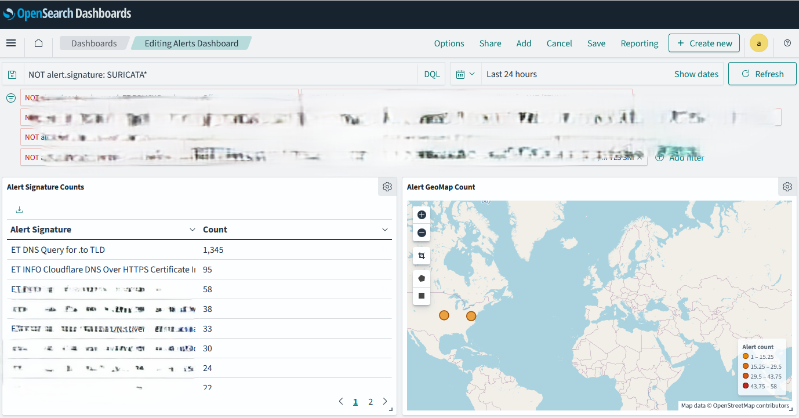
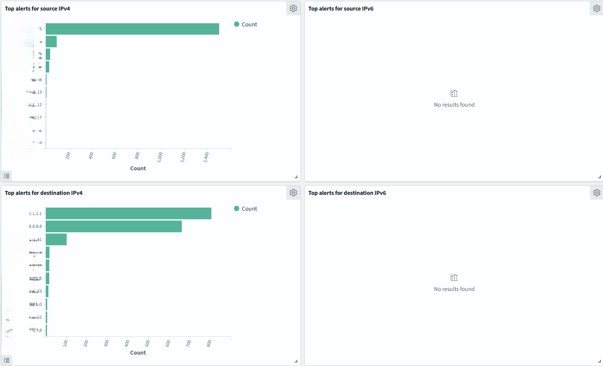
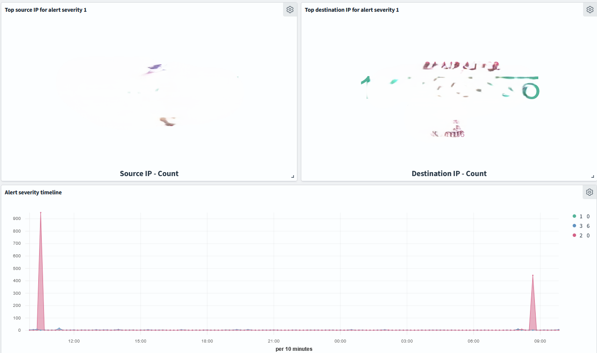
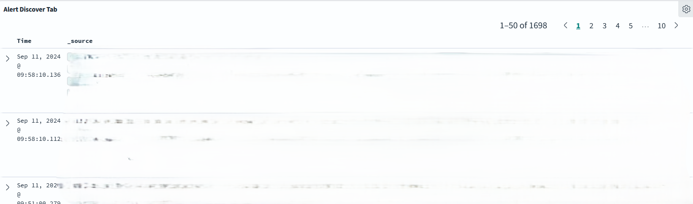

# Chapter 7: Harnessing Intrusion Detection Systems

## List of alerts
This is a useful data table that can help you identify alerts that are being generated by your intrusion detection system.

1. Go to the Opensearch Dashboards web interface.
2. Click on the "Visualize" tab in the left top area.
3. Click on "Create visualization".
4. Select "Data table" as the visualization type.
5. Select the index pattern (logstash*) and click "Next step".
6. Select "Split rows" and then "Aggregation" as "Terms".
7. Select "Field" as `alert.signature.keyword` and click "Apply".
8. Increase the "Size" to 1000 to show all the alerts.
9. Save the visualization as "Data Table - Alerts".

## Alert Geo Map

This visualization can help you identify the geographical locations of the alerts generated by your intrusion detection system. This does not include alerts generated by local to local IP addresses.

1. Go to the Opensearch Dashboards web interface.
2. Click on the "Visualize" tab in the left top area.
3. Click on "Create visualization".
4. Select "Coordinate Map" as the visualization type.
5. Select the index pattern (logstash*) and click "Next step".
6. Select "Geohash" as the aggregation type.
7. Select "Field" as `geoip.geohash`.
8. Add a filter for `event_type.keyword:alert` to ensure only alerts are shown.
9. Save the visualization as "Coordinate Map - Alert Geo Map".

## Top alerts by source IP (IPv4)

This visualization can help you identify the top alerts generated by source IPv4 addresses.

1. Go to the Opensearch Dashboards web interface.
2. Click on the "Visualize" tab in the left top area.
3. Click on "Create visualization".
4. Select "Data table" as the visualization type.
5. Select the index pattern (logstash*) and click "Next step".
6. Select "Split rows" and then "Aggregation" as "Terms".
7. Select "Field" as `src_ip.keyword` and click "Apply".
8. Increase the "Size" to 1000 to show all the source IPs.
9. Add a filter for `event_type.keyword:alert` to ensure only alerts are shown.
10. Add a filter for IPv4 addresses only. Click "Add filter" then `src_ip` with operator `is between` values `0.0.0.0` and `255.255.255.255`.
10. Save the visualization as "Data Table - Top Alerts by Source IP (IPv4)".

You can do the same to generate a visualization for destination IP addresses.

## Top alerts by source IP (IPv6)

This visualization can help you identify the top alerts generated by source IPv6 addresses.

1. Go to the Opensearch Dashboards web interface.
2. Click on the "Visualize" tab in the left top area.
3. Click on "Create visualization".
4. Select "Data table" as the visualization type.
5. Select the index pattern (logstash*) and click "Next step".
6. Select "Split rows" and then "Aggregation" as "Terms".
7. Select "Field" as `src_ip.keyword` and click "Apply".
8. Increase the "Size" to 1000 to show all the source IPs.
9. Add a filter for `event_type.keyword:alert` to ensure only alerts are shown.
10. Add a filter for IPv6 addresses only. Click "Add filter" then `src_ip` with operator `is not between` values `0.0.0.0` and `255.255.255.255`.
10. Save the visualization as "Data Table - Top Alerts by Source IP (IPv6)".

Do the same for destination IP addresses.

## Top source IP for high severity alerts

1. Go to the Opensearch Dashboards web interface.
2. Click on the "Visualize" tab in the left top area.
3. Click on "Create visualization".
4. Select "Data table" as the visualization type.
5. Select the index pattern (logstash*) and click "Next step".
6. Select "Split rows" and then "Aggregation" as "Terms".
7. Select "Field" as `src_ip.keyword` and click "Apply".
8. Increase the "Size" to 1000 to show all the source IPs.
9. Add a filter for `event_type.keyword:alert` to ensure only alerts are shown.
10. Add a filter for `alert.severity: 1`.
11. Save the visualization as "Data Table - Top Source IP for High Severity Alerts".

Do the same for destination IP addresses.

## Alert severity timeline

For this we'll use TSVB to create a timeline visualization of the alert severity over time.

1. Go to the Opensearch Dashboards web interface.
2. Click on the "Visualize" tab in the left top area.
3. Click on "Create visualization".
4. Select "Time Series Visual Builder" as the visualization type.
5. Select the index pattern (logstash*) and click "Next step".
6. Select "Aggregation" as "Terms".
7. Select "Field" as `alert.severity` and click "Apply".
8. In label write "Alert Severity".
9. Click on the "Save" button to save the visualization as "TSVB - Alert Severity Timeline".

## Alert discover tab

This is useful for reviewing quickly some data about the alerts you are observing.

1. Go to the Opensearch Dashboards web interface.
2. Click on the "Discover" tab in the left top area.
3. Click on "Create index pattern" and select the index pattern (logstash*).
4. Click on "Discover" to see the data.
5. You can filter the data by `event_type.keyword:alert` to see only alerts.
6. Save the search as "Alert Discover".

## Putting all together in a Dashboard

Now that you have created all these visualizations, you can put them together in a dashboard to get a comprehensive view of the alerts generated by your intrusion detection system.

1. Go to the Opensearch Dashboards web interface.
2. Click on the "Dashboard" tab in the left top area.
3. Click on "Create dashboard".
4. Click on "Add" to add the visualizations you created to the dashboard.
5. Arrange the visualizations as you see fit.
6. Click on the "Save" button to save the dashboard.

Here's how it look like:






## How to use
The best approach for this dashboard is rinse and repeat. Start removing any alerts that are false positives including all SURICATA:
```
NOT alert.signature: SURICATA*
```

Then start looking at the alerts that are left. You can start by looking at the top alerts by source IP and destination IP. This can help you identify the top sources of alerts in your network. You can then drill down into the alerts generated by these IP addresses to investigate further. 

If you see an alert that stands out, isolate it and investigate. You can use the alert discover tab to quickly filter the data and see the details of the alert. This can help you understand the context in which the alert was generated and take appropriate action.

Then switch to the "Discover" tab and look for 1-2 minutes within that time frame. More information about this strategy is provided in the book.