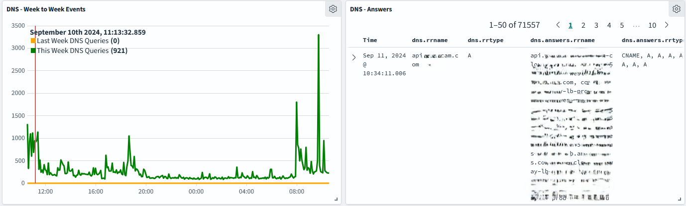

# Chapter 8: Hunting for Malware

This  guide consists of two segmenets.

- Making DNS dashboard as a means of monitoring for peculiar DNS tunnels or C2 traffic.
- Using Sigma rules to detect malware.

## DNS Dashboard

### Destination DNS servers

1. Go to the Opensearch Dashboards web interface.
2. Click on the "Visualize" tab in the left top area.
3. Click on "Create visualization".
4. Select "Data table" as the visualization type.
5. Select the index pattern (logstash*) and click "Next step".
6. Select "Split rows" and then "Aggregation" as "Terms".
7. Select "Field" as `dest_ip` and click "Apply".
8. Increase the "Size" to 1000 to show all the destination IPs.
9. Set filters to `event_type.keyword:dns` and `dns.type.keyword:query`.
10. Save the visualization as "Data Table - Destination DNS Servers".

### Source IP DNS queries

1. Go to the Opensearch Dashboards web interface.
2. Click on the "Visualize" tab in the left top area.
3. Click on "Create visualization".
4. Select "Tag cloud" as the visualization type.
5. Select the index pattern (logstash*) and click "Next step".
6. Select "Aggregation" as "Terms".
7. Select "Field" as `src_ip.keyword` and click "Apply".
8. Increase the "Size" to 20 to show the top 20 source IPs.
9. Set filters to `event_type.keyword:dns` and `dns.type.keyword:query`.
10. Save the visualization as "Tag Cloud - Source IP DNS Queries".

### DNS query response types

1. Go to the Opensearch Dashboards web interface.
2. Click on the "Visualize" tab in the left top area.
3. Click on "Create visualization".
4. Select "Pie" as the visualization type.
5. Select the index pattern (logstash*) and click "Next step".
6. Select "Split slices" and then "Aggregation" as "Terms".
7. Select "Field" as `dns.rcode.keyword` and click "Apply".
8. Set filters to `event_type.keyword:dns` and `dns.type.keyword:answer`.
9. Save the visualization as "Pie - DNS Query Response Types".

### NXDOMAIN responses (domain does not exist)

1. Go to the Opensearch Dashboards web interface.
2. Click on the "Visualize" tab in the left top area.
3. Click on "Create visualization".
4. Select "Timeline" as the visualization type.
5. Then on the right hand side, type the following:
```
.es(index=logstash-*, q='event_type:dns AND dns.rcode:NXDOMAIN').title('NXDOMAIN Instances')
```
6. Save the visualization as "Timeline - NXDOMAIN Responses".

### DNS week to week events

1. Go to the Opensearch Dashboards web interface.
2. Click on the "Visualize" tab in the left top area.
3. Click on "Create visualization".
4. Select "Timeline" as the visualization type.
5. Then on the right hand side, type the following:
```
.es(index=logstash*, q='event_type:DNS AND dns.type=query', metric=count, timefield=@timestamp, offset=-1w).label('Last Week DNS Queries').color(orange),
.es(index=logstash*, q='event_type:DNS AND dns.type=query', metric=count, timefield=@timestamp).label('This Week DNS Queries').color(green)
```
6. Save the visualization as "Timeline - DNS Queries Week to Week".

### DNS queries discover

1. Go to the Opensearch Dashboards web interface.
2. Click on the "Discover" tab in the left top area.
3. Select the following fields from the left hand side and add them:
- `dns.rrname`
- `dns.rrtype`
- `dns.answers.rrname`
- `dns.answers.rrtype`
4. Add filters for `event_type.keyword:dns` and `dns.type.keyword:answer`.
5. Save the search as "DNS Queries Discover".

### DNS Geo Map

1. Go to the Opensearch Dashboards web interface.
2. Click on the "Visualize" tab in the left top area.
3. Click on "Create visualization".
4. Select "Coordinate Map" as the visualization type.
5. Select the index pattern (logstash*) and click "Next step".
6. Select "Geohash" as the aggregation and then "Field" as `geoip.geohash`.
7. Add a filter for `event_type.keyword:dns` and `dns.type.keyword:query`.
8. Save the visualization as "Coordinate Map - DNS Geo Map".

### High entropy DNS queries

You'll need scripted fields for this.

#### Scripted field for entropy

1. Go to the Opensearch Dashboards web interface.
2. Click on the "Dashboards Management" tab in the left top area.
3. Click on "Index Patterns".
4. Click on the index pattern you're using (logstash*).
5. Click on the "Scripted fields" tab.
6. Click on "Add scripted field".
7. Name the field "dns_rrname_shannon_entropy" and scroll all the way down to "Script" and type the following:
```
if (!doc.containsKey('dns.rrname.keyword') || doc['dns.rrname.keyword'].empty) {
    return null;
}

String rrname = doc['dns.rrname.keyword'].value;

int[] counts = new int[256]; // Assuming ASCII characters

for (int i = 0; i < rrname.length(); i++) {
    int charValue = (int) rrname.charAt(i);
    counts[charValue]++;
}

double entropy = 0;
int rrnameLength = rrname.length();

for (int count : counts) {
    if (count != 0) {
        double p = (double) count / rrnameLength;
        entropy -= p * Math.log(p) / Math.log(2);
    }
}

return entropy;
```
8. Set "Type" as "Number" and click on "Create field".

#### High entropy DNS queries

1. Go to the Opensearch Dashboards web interface.
2. Click on the "Visualize" tab in the left top area.
3. Click on "Create visualization".
4. Select "Data table" as the visualization type.
5. Select the index pattern (logstash*) and click "Next step".
6. Select "Split rows" and then "Aggregation" as "Terms".
7. Select "Field" as `dns.rrname.keyword` and click "Apply".
8. Increase the "Size" to 1000 to show all the DNS queries.
9. Add a filter for `event_type.keyword:dns` and `dns.type.keyword:query`.
10. Set "Metric" as "Max" and then "Field" as `dns_rrname_shannon_entropy`.
11. Save the visualization as "Data Table - High Entropy DNS Queries".

### Rare domain names

1. Go to the Opensearch Dashboards web interface.
2. Click on the "Visualize" tab in the left top area.
3. Click on "Create visualization".
4. Select "Data table" as the visualization type.
5. Select the index pattern (logstash*) and click "Next step".
6. Select "Split rows" and then "Aggregation" as "Terms".
7. Select "Field" as `dns.rrname.keyword` and click "Apply".
8. Increase the "Size" to 50 to show all the DNS queries.
9. Add a filter for `event_type.keyword:dns` and `dns.type.keyword:query`.
10. Save the visualization as "Data Table - Rare Domain Names".

### Putting it all together

You can create a dashboard and add all these visualizations to it. This will give you a comprehensive view of your DNS traffic.

1. Go to the Opensearch Dashboards web interface.
2. Click on the "Dashboard" tab in the left top area.
3. Click on "Create dashboard".
4. Click on "Add" and select the visualizations you've created.
5. Save the dashboard.

Here's how it look like:





## Sigma rules

Visit the Sigma repository [Sigma Repository](https://github.com/SigmaHQ/sigma). There are several rules that may or may not apply to your network or context (e.g., compliance is typically for organizations). You can browse through them and evaluate which ones you'd like to use. Keep an eye out for rules with network traffic. Some involve operating system logs that the book's setup does not collect. You'll need a Host IDS (HIDS) for that.

### Download Sigma rules
Let's look at a rule for Telegram traffic:
[Telegram Traffic](https://github.com/SigmaHQ/sigma/blob/master/rules/network/dns/net_dns_susp_telegram_api.yml)

Hit the download icon ("download raw file") to download the yml file. Also have a look at the rule itself. It's a simple rule that looks for DNS queries to Telegram's API. Good news! You have DNS data available from your IDS. You can use this rule to detect Telegram traffic on your network.

### Import Sigma rules

1. Go to the Opensearch Dashboards web interface.
2. Click on the "Security Analytics" tab in the left top area.
3. Click on "Detection rules".
4. Click on "Import detection rule".
5. Click on "Select a file" and select the Sigma rule you downloaded.
6. Click on "Import".
7. You'll see a visual editor to evaluate the rule. If there are any errors (meaning Dashboards cannot find your corresponding data), here's where you can fix them.
8. Key points to keep an eye out for:
- "Rule Status" is set for default as "test". You can change it to "stable" when you're ready.
9. Then click on "Create detection rule".

Detection rules also contains a bunch of pre-built rules that you can use. For example, you can also use the search bar to search for "Wannacry Killswitch Domain" and you'll find a rule that detects the presense of Wannacry domain requests.

### Create an alias for all logstash indexes

1. Go to the Opensearch Dashboards web interface.
2. Click on the "Index Management" tab in the left top area.
3. Click on "Aliases".
4. Click "Create Alias".
5. Type "logstash-*" in the "Index pattern" field.
6. Type "logstash" in the "Alias" field.
7. Click "Create index alias".


### Implementing Sigma rules

1. In "Security Analytics" click on "Detectors".
2. Click on "Create detector".
3. Type "Threat Huntin" in the "Name" and feel free to write a description for it.
4. For "Data Source" type "logstash" (the alias) and hit enter.
5. "Log type" is "DNS". Different rules are listed under a different log type and you need to make a separate detector for each.
6. In "Selected detection rules", expand it and use the slide bar next to the "Rule name" to disable them all. Then search and enable only the two rules from above.
7. Underneath, at "Field Mapping", map the Available fields that are found from the rules to your data fields.
- `dns.question.name` to `dns.query.rrname`
- `timestamp` to `@timestamp`
8. Set the detector schedule on how frequently you want it to run.
9. Click "Next"
10. Leave everything as default in the "Trigger" section.
11. Click "Create detector".

Now if you click on "Overview" under "Security Analytics" you'll see the detector at the bottom. You should see no alerts but if you want to verify that everything works, open your browser and navigate to `api.telegram.org`. Then in about a minute you should see alerts generated in the "Overview" panel. Here's how it looks:


You can click on the findings ("View all findings") on the right hand side to see the details of the alert. Then click in any alert and you should see additional information about it including the json record that triggered it. Here it is:


Feel free to ignore in_i_face since that is the network interface of your IDS, not of the machine that did the query to telegraph (through the browser in this case). The rest of the information should be valid though to the time you queried and from the computer that you did.

## Threat Intelligence (Reputation)
Since we are working on setting up a threat hunting environment, it would be useful to have also threat intelligence. 

1. Go to the Opensearch Dashboards web interface.
2. Click on the "Security Analytics" tab in the left top area.
3. Click on "Threat Intelligence".
4. You should see an alienvault source reputation rule set there but if not you could manually add it.
5. Click on "Add threat intel source".
6. Give it a name and description.
7. Type is "remote data store location".
8. In the "Specify a directory or file" type `https://reputation.alienvault.com/reputation.generic`.
9. Select IPv4-Address from the "Types of malicious indicators" and click "Add threat intel source".

Then you need to configure a periodic scanner on your data.

1. Click "Configure scan".
2. Select any alias you have (logstash) and click "Next". This will select the alias not the index.
3. In the fields to scan, select IPv4-Address and click "Add fields" and add `src_ip` and `dest_ip`.
4. Set the scan for every minute and hit "Next".
5. Click "Save and start monitoring".
