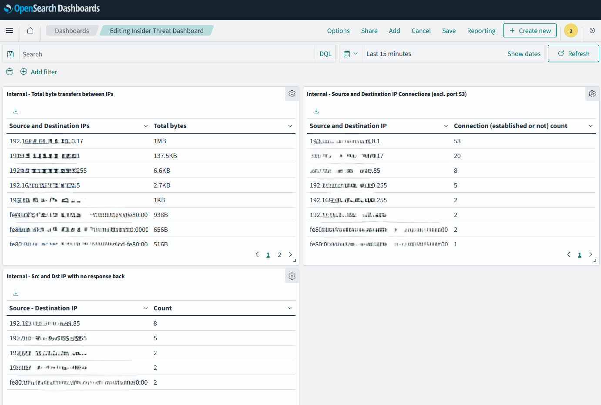

# Chapter 9: Recognizing threats from within

## Byte transfers between internal IP pairs

1. Go to the Opensearch Dashboards web interface.
2. Click on the "Visualize" tab in the left top area.
3. Click on "Create visualization".
4. Select "Data table" as the visualization type.
5. Select the index pattern (logstash*) and click "Next step".
6. Select "Split rows" and then "Aggregation" as "Terms".
7. Select "src_dest_ip" as the field and click "Apply changes".
8. In "Metric," select "Sum" and `flow.total_bytes` as the field.
9. Then, in the filter restrict to only local data using the following query:
```
(src_ip:(
  "10.0.0.0/8" or 
  "172.16.0.0/12" or 
  "192.168.0.0/16" or 
  "fc00::/7" or 
  "fe80::/10"
) and 
dest_ip:(
  "10.0.0.0/8" or 
  "172.16.0.0/12" or 
  "192.168.0.0/16" or 
  "fc00::/7" or 
  "fe80::/10"
))
```
10. Save the visualization with a name such as "Byte transfers between internal IP pairs".

## IP connections between source and destination IP pairs

1. Go to the Opensearch Dashboards web interface.
2. Click on the "Visualize" tab in the left top area.
3. Click on "Create visualization".
4. Select "Data table" as the visualization type.
5. Select the index pattern (logstash*) and click "Next step".
6. Select "Split rows" and then "Aggregation" as "Terms".
7. Select "src_dest_ip" as the field and click "Apply changes".
8. Restrict data to only flows `event_type:flow`. You also need to restrict port 53 (DNS) traffic to avoid noise otherwise, it will clutter the table. Use `NOT dest_port:53` in the filter.
9. Restrict traffic to only local IPs using:
```
(src_ip:(
  "10.0.0.0/8" or 
  "172.16.0.0/12" or 
  "192.168.0.0/16" or 
  "fc00::/7" or 
  "fe80::/10"
) and 
dest_ip:(
  "10.0.0.0/8" or 
  "172.16.0.0/12" or 
  "192.168.0.0/16" or 
  "fc00::/7" or 
  "fe80::/10"
))
```
10. Save the visualization with a name such as "IP connections between source and destination IP pairs".

## No response visualization for internal IP pairs

1. Go to the Opensearch Dashboards web interface.
2. Click on the "Visualize" tab in the left top area.
3. Click on "Create visualization".
4. Select "Data table" as the visualization type.
5. Select the index pattern (logstash*) and click "Next step".
6. Select "Split rows" and then "Aggregation" as "Terms".
7. Select "src_dest_ip" as the field and click "Apply changes".
8. Use the following filters:
- `event_type:flow`
- `flow.pkts_toclient:0`
9. Restrict traffic to only local IPs using:
```
(src_ip:(
  "10.0.0.0/8" or 
  "172.16.0.0/12" or 
  "192.168.0.0/16" or 
  "fc00::/7" or 
  "fe80::/10"
) and 
dest_ip:(
  "10.0.0.0/8" or 
  "172.16.0.0/12" or 
  "192.168.0.0/16" or 
  "fc00::/7" or 
  "fe80::/10"
)) and not (
  src_ip: "255.255.255.255" or 
  src_ip: "224.0.0.0/4" or 
  src_ip: "ff00::/8" or 
  dest_ip: "255.255.255.255" or 
  dest_ip: "224.0.0.0/4" or 
  dest_ip: "ff00::/8"
)
```
10. Save the visualization with a name such as "No response visualization for internal IP pairs".

## Putting it all together

1. Go to the Opensearch Dashboards web interface.
2. Click on the "Dashboard" tab in the left top area.
3. Click on "Create dashboard".
4. Click on "Add" in the top area.
5. Select the visualizations you created in the previous steps.
6. Click on "Save" and give the dashboard a name such as "Internal IP traffic analysis".

Here's how it looks like:
