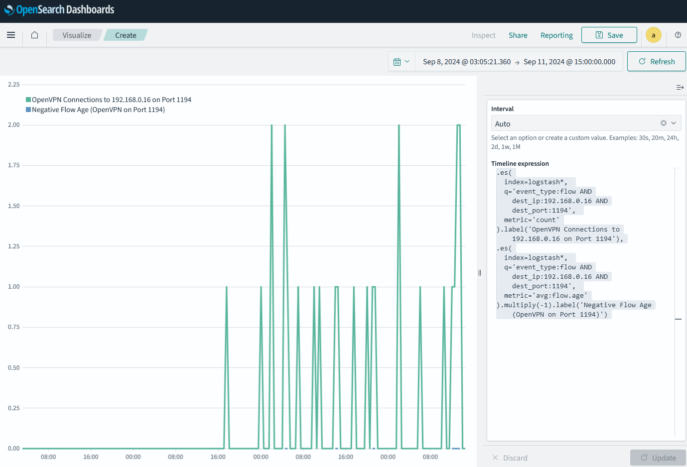

# Chapter 10: Working Remote or on the Cloud

## Monitoring remote VPN connections

1. Go to the Opensearch Dashboards web interface.
2. Click on the "Visualize" tab in the left top area.
3. Click on "Create visualization".
4. Select "Timeline" as the visualization type.
5. Select the index pattern (logstash*) and click "Next step".
6. On the right hand side add the following:
```
.es(
  index=logstash*, 
  q='event_type:flow AND dest_ip:192.168.0.16 AND dest_port:1194', 
  metric='count'
).label('OpenVPN Connections to 192.168.0.16 on Port 1194'),
.es(
  index=logstash*, 
  q='event_type:flow AND dest_ip:192.168.0.16 AND dest_port:1194', 
  metric='avg:flow.age'
).multiply(-1).label('Negative Flow Age (OpenVPN on Port 1194)')
```
Adapt as needed for your VPN server IP and port.

Here's how it looks like:
