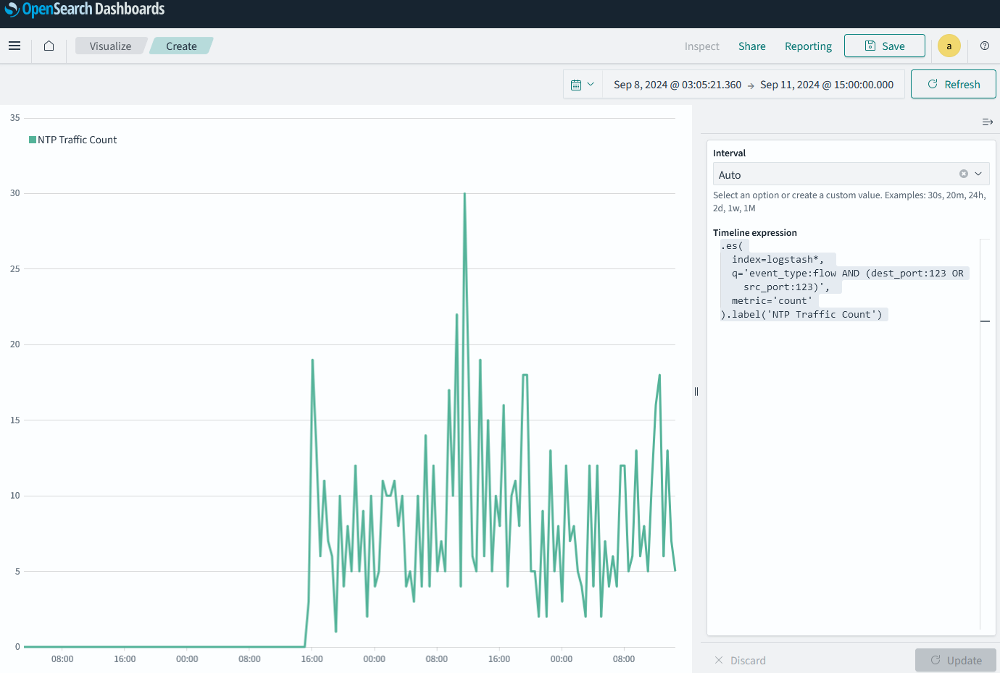

# Chapter 11: Powering Up your Skills

## Building visualizations using ChatGPT

Building time series visualizations can be challenging but you can use ChatGPT to speed things up. Say that you wanted to identify NTP traffic from devices on your network.

1. Go to the [ChatGPT](https://app.openai.com/) web interface.
2. Type:
```
I want to visualize NTP traffic from devices on my network using Timelion on Kibana. My index is logstash*.
```
ChatGPT is more familiar with Kibana's Timelion than Opensearch's Timeline, but they are the same thing.
3. Its response is:
```
.es(
  index=logstash*, 
  q='event_type:flow AND (dest_port:123 OR src_port:123)', 
  metric='count'
).label('NTP Traffic Count')
```

Just make sure to be as specific as possible when asking ChatGPT for help.

Here's the image of the visualization:
